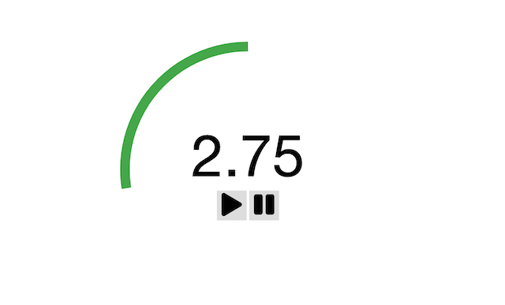
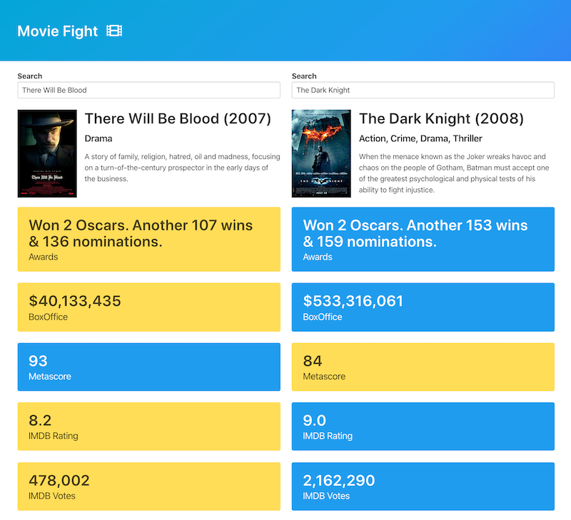
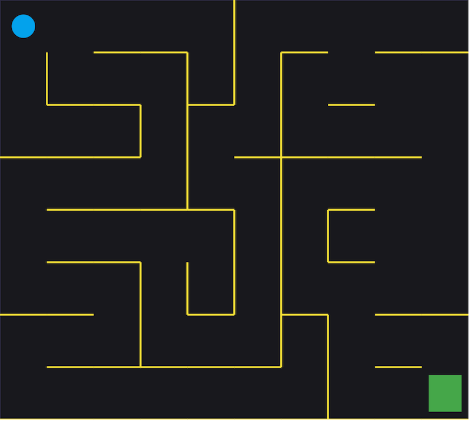
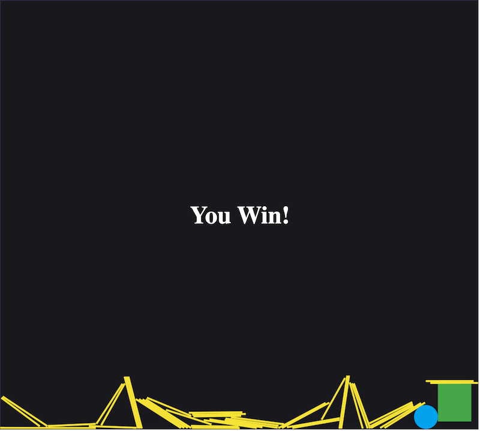

# New Modern JS Projects

A collection of projects from the Udemy course _The Modern Javascript Bootcamp (2020)_ - _[course link](https://www.udemy.com/course/javascript-beginners-complete-tutorial/)_.

## Projects List

- [Timer](#timer)
- [Movie Fight](#movie-fight)
- [Maze](#maze)

## Timer

A JavaScript class-based timer app. Set the time and start/pause the countdown.

#### Built With

- [Font Awesome](https://fontawesome.com/) for control button icons
- SVG animation for time remaining ticker

## Movie Fight

A movie comparison app, with data from [OMDb API](http://omdbapi.com/). Implements an autocomplete search with debounce.

#### Built With

- [Axios](https://github.com/axios/axios) - HTTP client
- [Bulma](https://bulma.io/) - CSS framework
- [Font Awesome](https://fontawesome.com/) - Icon library

## Maze

A physics based maze app using the MatterJS engine. Move a ball through a 2D canvas maze to reach the goal.

 

#### Built With

- [Matter.js](https://brm.io/matter-js/) - 2D JavaScript physics engine
